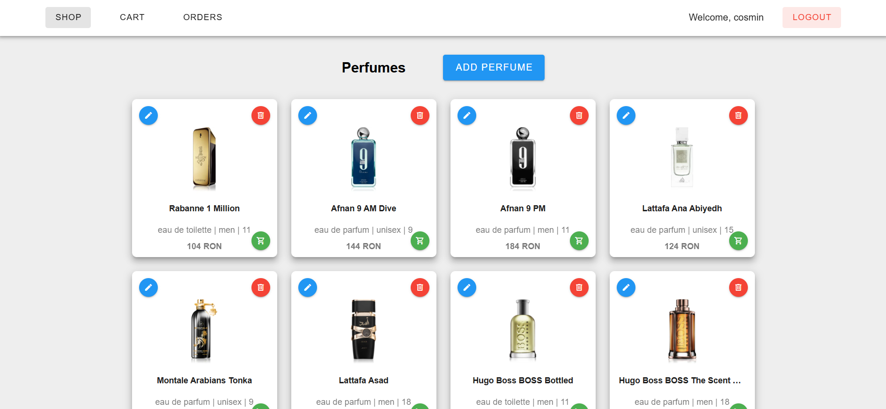
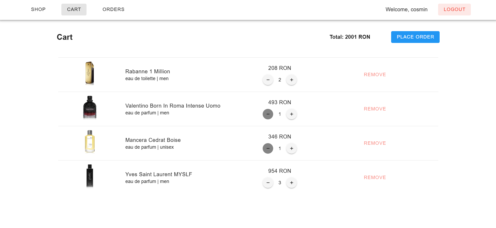
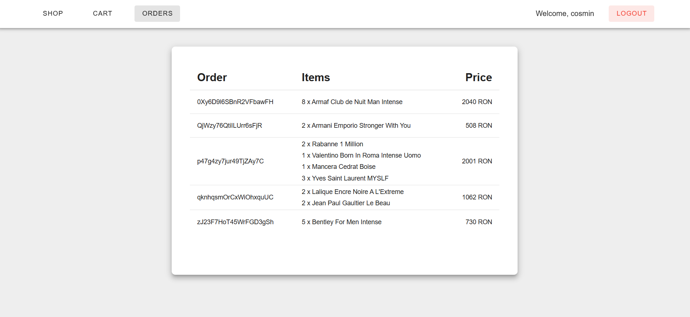

# E-Commerce Web Application

This is a full-stack e-commerce web app built with Vue and Express. The application allows users to browse, search and purchase perfumes.

## Features
- **perfume catalog with searching bar**
- **shopping cart with checkout and order history**
- **responsive UI**: designed responsive views using Vuetify
- **user authentication and authorization**: secure users data using JWT and HttpOnly Cookies
- **perfume images upload**: users with admin role can upload perfume images using Firebase Storage
- **infinite scroll pagination**: Shop page supports infinte scrolling, loading dynamically more perfumes

## Live Demo
Check out the live version of the application: 
[e-commerce demo](https://cosmin-e-commerce-frontend.vercel.app)

## Shop Page

## Cart Page

## Orders Page

